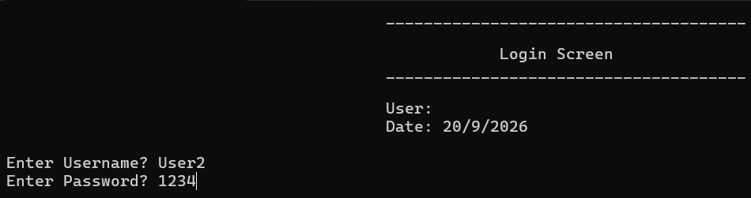
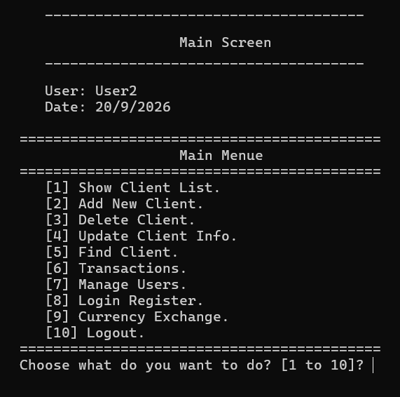
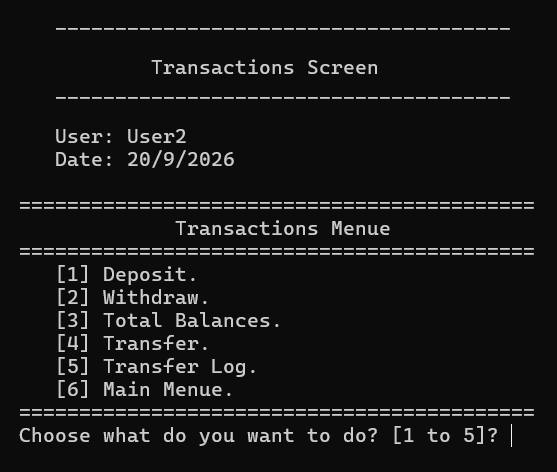
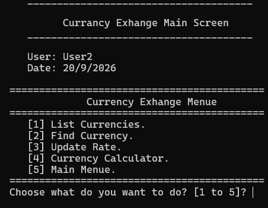
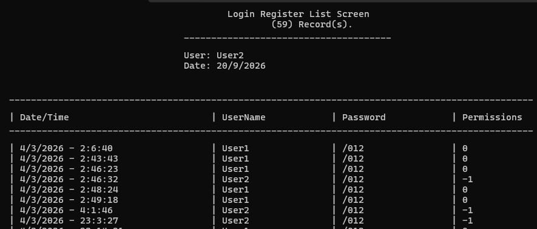

<h1 align="center">Console-Based CRM System</h1>

  <strong>A backend-focused Customer Relationship Management system built from scratch in C++</strong>

  
  
  
  

  <a href="#overview">Overview</a> &nbsp;|&nbsp;
  <a href="#key-features">Key Features</a> &nbsp;|&nbsp;
  <a href="#skills-demonstrated">Skills</a> &nbsp;|&nbsp;
  <a href="#screenshots">Screenshots</a> &nbsp;|&nbsp;
  <a href="#how-to-run">How to Run</a>

---

## Overview

This project is a console-based CRM (Customer Relationship Management) application designed to manage customer data and system users. It enforces role-based access control and follows structured program logic, so each user can only access the operations their role allows.

The system was implemented from scratch with a modular design and file-based data handling. The focus of the project is a clean structure, readable code, and logic that is easy to maintain and extend.

---

## Key Features

| Feature | Description |
| :-- | :-- |
| **Customer Management** | Store and manage customer data |
| **User Management** | Create and manage the system's users |
| **Role-Based Access Control** | Permissions are enforced according to each user's role |
| **Secure Login** | Users must authenticate before using the system |
| **Transactions** | Handle and track transactions inside the system |
| **Currency Exchange** | Currency exchange operations |
| **File-Based Data Handling** | Data is saved between runs |
| **Modular Design** | Code is separated into clear, reusable components |

---

## Skills Demonstrated

  
  
  
  
  
  

---

## Screenshots

<h3 align="center">Login</h3>

<em>Users authenticate before they can access the system.</em>

  

 

<h3 align="center">Main Menu</h3>

<em>The central point from which every module of the system is reached.</em>

  

 

<h3 align="center">Transactions</h3>

<em>The transactions module.</em>

  

 

<h3 align="center">Currency Exchange</h3>

<em>The currency exchange module.</em>

  

 

<h3 align="center">User Management</h3>

<em>Management of the system's users and their access.</em>

  

---

## How to Run

1. Download or clone this repository. Click **Code**, then **Download ZIP**, or clone it with Git.
2. Open `Console_Based CRM System.sln` in Visual Studio.
3. Set the configuration to **Debug** and **x64**.
4. Press **Ctrl+F5** to build and run the project.

---

## Developed By

  <strong>Talal Altuwairiqi</strong> 
  Senior Computer Science Student | Back-End Development

  
  
  

